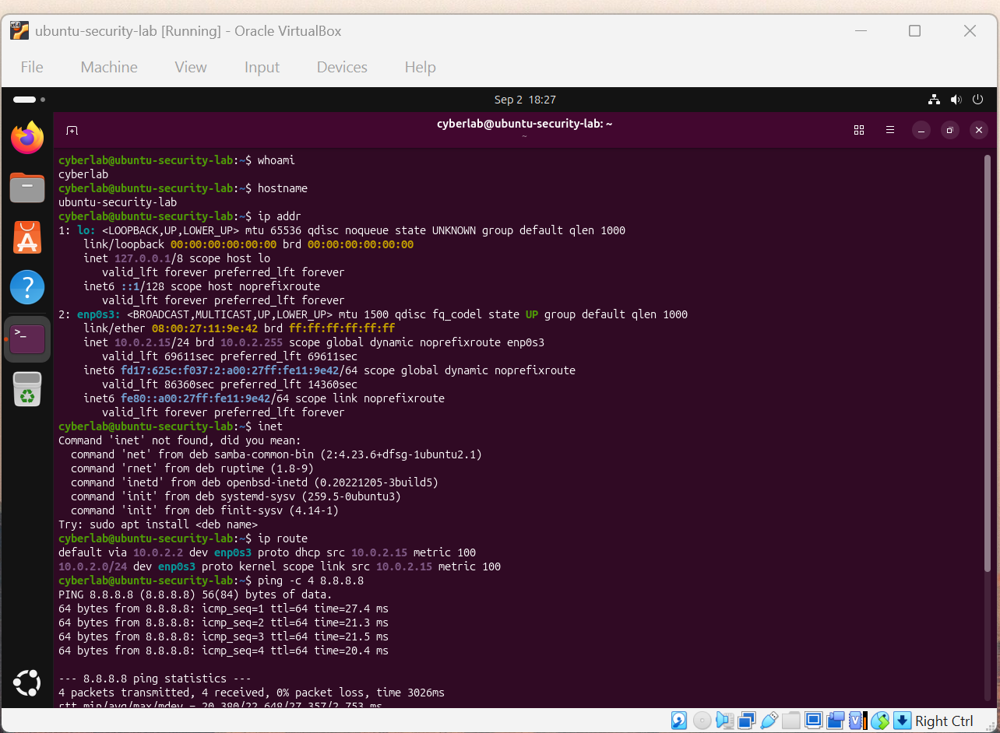
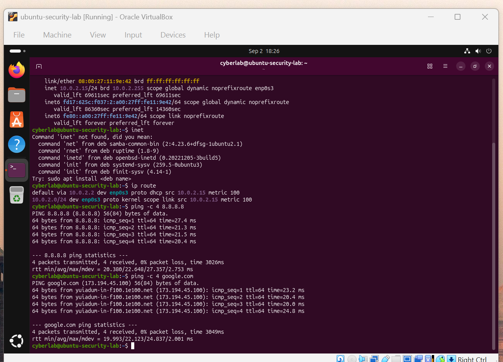
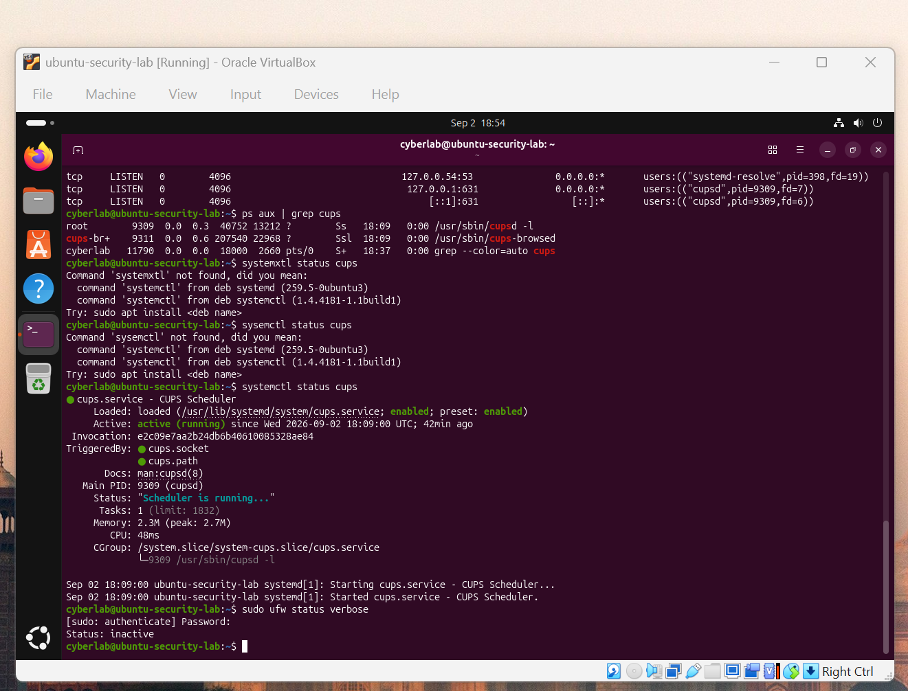
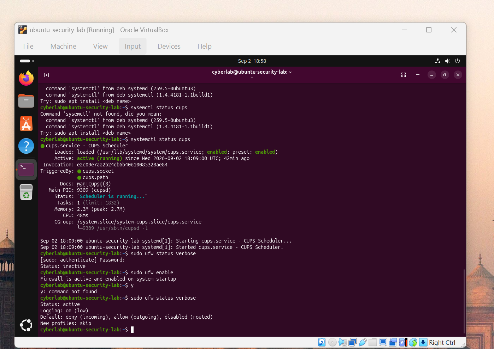

# Cybersecurity Home Lab

## Overview

This project documents my hands-on cybersecurity home lab built using Oracle VirtualBox and Ubuntu Linux.

The goal of this lab is to develop practical skills in Linux administration, networking, service enumeration, firewall configuration, system hardening, and security monitoring.

## Lab Environment

- Host OS: Windows 11
- Hypervisor: Oracle VirtualBox
- Guest OS: Ubuntu 26.04.1 LTS
- RAM: 4 GB
- Virtual CPUs: 2
- Virtual Disk: 50 GB
- Network Mode: NAT

## Skills Practiced

- Linux command-line administration
- TCP/IP networking
- IP address identification
- Routing table analysis
- DNS troubleshooting
- Network connectivity testing
- Listening port enumeration
- Process and service investigation
- Linux firewall configuration
- Basic system hardening

## Network Configuration

I identified the Ubuntu VM's network configuration using:

```bash
whoami
hostname
ip addr
ip route
```

The virtual machine was assigned the following network configuration:

```text
Interface: enp0s3
IPv4 Address: 10.0.2.15/24
Default Gateway: 10.0.2.2
```

This showed that the VM was connected through the VirtualBox NAT network.
### Network Evidence





## Connectivity Testing

I verified external IP connectivity using:

```bash
ping -c 4 8.8.8.8
```

I then tested DNS name resolution using:

```bash
ping -c 4 google.com
```

Both tests completed successfully with 0% packet loss.

## Service and Port Enumeration

I identified listening TCP and UDP ports using:

```bash
ss -tuln
```

I then used elevated privileges to identify the processes associated with those ports:

```bash
sudo ss -tulpn
```

This demonstrated how a security analyst can correlate listening network ports with the processes responsible for them.


## Service Investigation

I investigated the CUPS printing service using:

```bash
ps aux | grep cups
systemctl status cups
```

The CUPS service was confirmed to be active and running.

CUPS commonly uses TCP port 631.

This demonstrated the relationship between:

**Process → Service → Network Port**

## Firewall Assessment

I checked the Ubuntu host firewall using:

```bash
sudo ufw status verbose
```

The initial result showed:

```text
Status: inactive
```

This meant that UFW was installed but was not actively filtering traffic.



## Firewall Hardening

I enabled UFW using:

```bash
sudo ufw enable
```

I then verified the configuration:

```bash
sudo ufw status verbose
```

The firewall showed:

```text
Status: active
Default: deny (incoming), allow (outgoing), disabled (routed)
```

This established a stronger security baseline by denying unsolicited inbound connections while allowing normal outbound traffic.



## Security Findings

During the assessment I identified:

- Multiple locally running network services
- CUPS listening on TCP port 631
- Several system services communicating over TCP and UDP
- UFW initially disabled
- UFW successfully enabled with a default-deny inbound policy

## What I Learned

This lab helped me understand how Linux systems communicate on a network and how cybersecurity professionals inspect:

- IP configuration
- Routing information
- Network connectivity
- DNS resolution
- Listening ports
- Running processes
- System services
- Host firewall configuration

I also gained hands-on experience using Linux commands commonly used during system administration, troubleshooting, and security investigations.

## Tools Used

- Oracle VirtualBox
- Ubuntu Linux
- Linux Terminal
- `ip`
- `ping`
- `ss`
- `ps`
- `systemctl`
- UFW

## Next Steps

Future additions to this cybersecurity lab will include:

- Windows virtual machines
- Active Directory
- Windows Event Logs
- Sysmon
- Splunk SIEM
- Vulnerability scanning
- Wireshark network analysis
- Security event detection
- Incident response exercises
